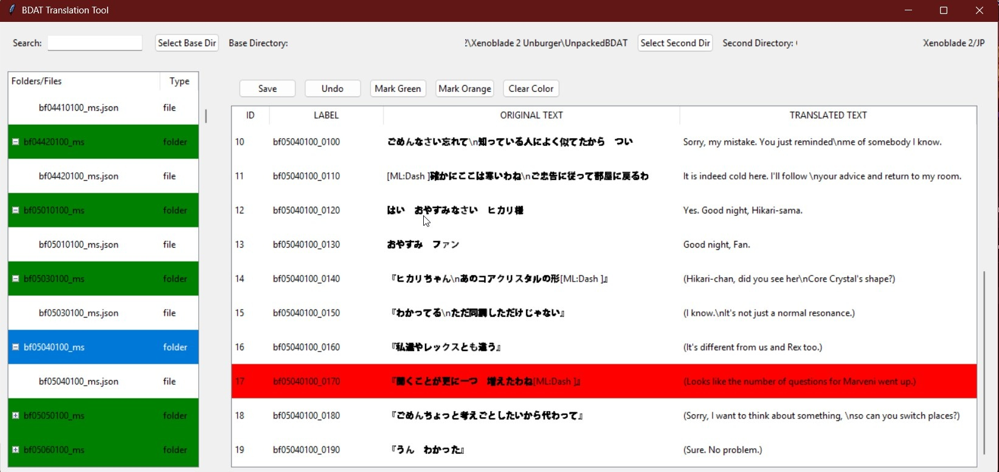

# 🌐 Xenoblade 2 BDAT Translation Tool

<div align="center">

*A GUI tool for translating Xenoblade 2 BDAT files*

[](https://www.python.org/)
[](https://www.nintendo.com/games/detail/xenoblade-chronicles-2-switch/)

</div>

## 📋 Overview

This translation tool provides a user-friendly interface for translating Xenoblade 2 extracted BDAT files. It's designed to work with BDAT files that have been extracted using the [BDAT Batch Extract/Unpack GUI Tool](https://github.com/rsc-pl/Xenoblade2-BDAT-Batch-Extract-Unpack-GUI).



## ✨ Features

- 🔍 Easy navigation through BDAT folders and files
- 📝 Side-by-side original text and translation editing
- 🎨 Translation progress tracking with color coding
- 🔄 Automatic progress saving
- 🔎 Quick search/filter functionality
- ⚡ Real-time text editing with special character support
- 💾 Automatic configuration saving
- 🔄 Dual directory support for original and translated files
- 📋 Copy cell contents functionality
- 🖥️ Quick access to file directories
- 💡 Smart unsaved changes detection
- 🔍 Enhanced search capabilities

## 📋 Requirements

- 🐍 Python 3.x
- 📦 tkinter (usually included with Python)
- 📂 Extracted BDAT files from the Xenoblade2-BDAT-Batch-Extract-Unpack-GUI Tool

## 🚀 Installation

1. 📥 Clone the repository
2. 📦 Ensure Python 3.x is installed with tkinter
3. ▶️ Run `python Xenoblade2-Translation-GUI.py`

## 📖 Usage Guide

### Initial Setup

1. Click "Select Base Dir" to choose the directory containing your translated BDAT folders
2. Click "Select Second Dir" to choose the directory containing original language BDAT files (optional)
3. The file tree will populate with all available BDAT folders and their JSON files

### Navigation

- 🔍 Use the search bar to filter folders and files in real-time
- 📂 Double-click folders or files to load them
- 📑 The right panel shows the content of the selected JSON file with both original and translated text
- 🖱️ Right-click on folders or files to:
  - Open the translated JSON directory
  - Open the original JSON directory (if second directory is set)

### Translation Process

1. Select a BDAT folder or JSON file from the left panel
2. Double-click the "TRANSLATED TEXT" cell to begin translation
3. Edit the text:
   - Press Enter to save changes
   - Use Ctrl+Enter for new lines
   - Press Escape to cancel editing
4. Special characters support:
   - `\n` for new lines
   - Square brackets `[ ]` are preserved

### Progress Tracking

The tool includes a color-coding system for tracking translation progress:

- 🟢 **Green**: Translation completed
- 🟧 **Orange**: Translation in progress
- ⬜ **No Color**: Not started

Use the buttons at the top to:
- "Mark Green" - Mark selected folder as completed
- "Mark Orange" - Mark selected folder as in progress
- "Clear Color" - Remove progress marking

### Working with Original Text

- 📝 Original text is displayed alongside the translation
- 🔄 Switch between original and translated files easily
- 📋 Right-click to copy cell contents
- 🖥️ Quick access to both original and translated file directories

### Saving and Undoing Changes

- 💾 Click "Save" to save your translations
- ↩️ Click "Undo" to revert to the last saved version
- ⚠️ The tool will prompt to save unsaved changes when switching files
- 🔄 Automatic state saving between sessions

## 🗃️ File Structure

The tool now supports two parallel directory structures:
```
Base Directory/ (Translated)
├── BDAT_Folder1/
│   └── BDAT_Folder1/
│       ├── file1.json
│       └── file2.json
└── translation_config.ini

Second Directory/ (Original)
├── BDAT_Folder1/
│   └── BDAT_Folder1/
│       ├── file1.json
│       └── file2.json
```

## 💾 Configuration Saving

The tool now saves two types of configurations:
1. **Translation Progress** (`translation_config.ini` in base directory):
   - Color coding status for folders and files
   - Translation progress tracking
2. **GUI State** (`Xenoblade2-Translation-GUI.ini` in script directory):
   - Base directory path
   - Second directory path
   - Window state and preferences

## 🔧 Technical Details

### Special Character Handling
- Special characters are displayed in a readable format during editing
- Automatic conversion between display and storage formats
- Preserves game-specific formatting requirements

## ⚠️ Important Notes

1. Always back up your original files
2. Save frequently to prevent loss of work
3. The tool automatically tracks unsaved changes
4. Use the search function to quickly find specific files
5. Color coding is saved across sessions
6. Original text is preserved in the second directory

## 🔄 Workflow Tips

1. Start by setting up both original and translated directories
2. Use the right-click menu for quick directory access
3. Copy original text cells for reference
4. Mark folders orange as you begin translation
5. Use the search function to find related content
6. Mark folders green when completely translated
7. Save regularly and check for unsaved changes warnings

## 🎮 Game Compatibility

- The tool is designed specifically for Xenoblade 2 BDAT files
- Maintains correct file structure and formatting
- Preserves special characters and game-specific requirements
- Supports parallel original/translated file structures

## 🔗 Related Tools

- [BDAT Batch Extract/Unpack GUI Tool](https://github.com/rsc-pl/Xenoblade2-BDAT-Batch-Extract-Unpack-GUI) - Required for extracting BDAT files before translation
